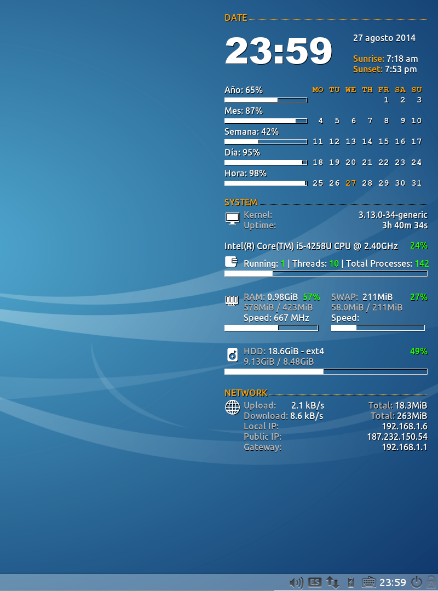

conky-theme-hatz
=====

My first conky theme for Lubuntu 14.04 LTS

    I have optimized it for 1920x1080 resolution. You can edit it.

# Why Conky?:

Conky is a free software system monitor for the X Window System for Gnu/Linux Systems.Conky is highly configurable and is able to monitor many system variables including the status of the CPU, memory, swap space, disk storage, temperatures, processes, network interfaces, battery power, system messages, e-mail inboxes, updates, many popular music players (MPD, XMMS2, BMPx, Audacious, etc.), weather updates, breaking news, and much more. 

Unlike system monitors that use high-level widget toolkits to render their information, Conky is drawn directly in an X window. This allows it to consume relatively fewer system resources.

Source: http://cont3mpo.blogspot.mx/2009/09/monitorea-todo-con-conky.html

Installation Notes:
===================

 Package Dependencies
 
     sudo apt-get install lm-sensors,hd-temp,curl,conky-all,dmidecode

After installing above packages you need to change permission of following packages

    sudo chmod u+s /usr/sbin/hddtemp
    sudo chmod u+s /usr/sbin/dmidecode
    
*other wise don't display hardware information and data weather.
 
You need to install Poky.ttf.

Install the "Poky.ttf" font by placing it in your $HOME/.fonts folder.

Install conkyrc file:
======================

Copy or remplace "conkyrc" into the home folder.

Setting conkyrc file:
======================

Now go to http://weather.yahoo.com and search you city
you will get a zip code of your city like '1915035' into urls.
Now copy the zip code and open 'conkyrc'.

Search the section "## - WEATHER - ##" and the line:

'${exec l=116545;curl -s http://weather.yahooapis.com/forec'....

replace code numbers with yours & save the file. By defual the file set "Mexico City"

Search the section "## - NETWORK - ##" and change your network interfaces (eth0, wlan0, wla1, etc). By default the file set "eth0"
To quickly identify all available network interfaces, you can use this command as shown below:

    sudo ifconfig
    sudo iwconfig

save the file and now add conky to start up application.

How to add startup applications in lubuntu?

1.Press the Lubuntu icon on the bottom left;
2.Select "Preferences" > "Default applications for LXSession";
3.In the opened window, select the option "Autostart";
4.Now you can enable or disable the autostarted applications, check/uncheck one in the listm or set manually on the field and pressing the "Add" button.

    conky -p 6

Enjoy :)

Changelogs:
==========

## v1.1  -   August 28, 2014

 + Add Local Weather Temperature (crawler from Yahoo Weather)
 + Add Date Long Format
 + Add Running Threads, Total Threads
 + Change Screenshot Readme

##Notes:

Yahoo weather don't reliable Celsius convertion from RSS, the next equation converts Fahrenheit to Celsius.

        celsius = (fahrenheit-32)*5/9;

## Screenshot:

## v1.0  -   August 27, 2014

+ First version
+ Direct Crawling Yahoo Weather

## Screenshot:

#To Do:

+ Add Table Condition Codes and linkage with "Conky Weather.ttf"
  Sources: https://developer.yahoo.com/weather/archive.html

